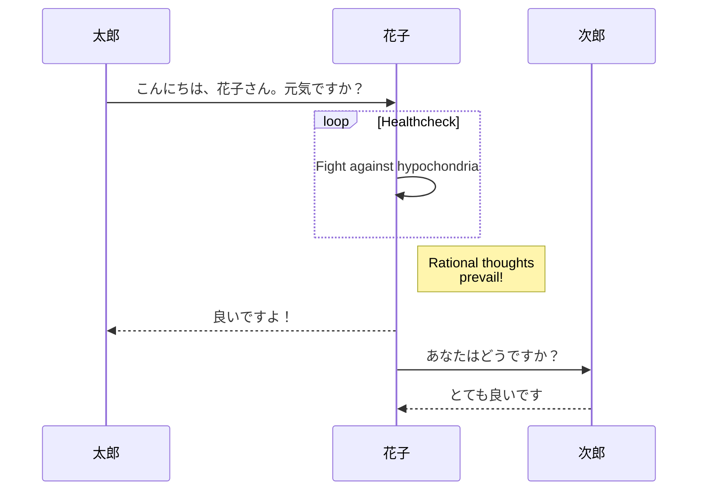

```mermaid
sequenceDiagram
    participant 太郎
    participant 花子
    太郎->>花子: こんにちは、花子さん。元気ですか？
    loop Healthcheck
        花子->>花子: Fight against hypochondria
    end
    Note right of 花子: Rational thoughts <br/>prevail!
    花子-->>太郎: 良いですよ！
    花子->>次郎: あなたはどうですか？
    次郎-->>花子: とても良いです
```