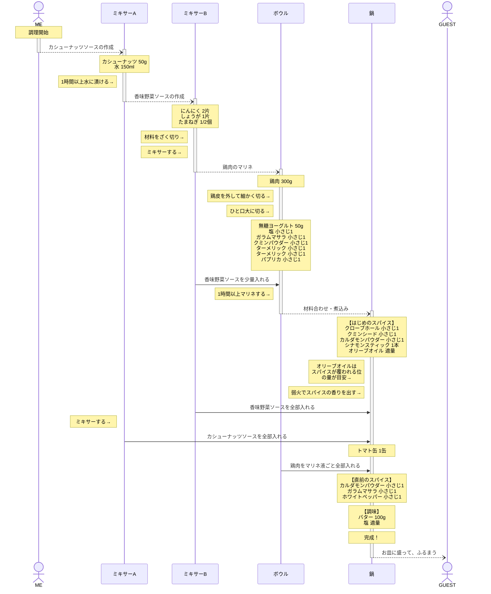

```mermaid
sequenceDiagram
    %% "KW" stands for "kitchenware"
    actor ME
    participant ミキサーA
    participant ミキサーB
    participant ボウル
    participant 鍋
    actor GUEST
    activate ME
    Note over ME:調理開始
    ME--)+ミキサーA:カシューナッツソースの作成
    deactivate ME
    Note over ミキサーA:カシューナッツ 50g<br/>水 150ml
    Note left of ミキサーA:1時間以上水に漬ける→
    ミキサーA--)+ミキサーB:香味野菜ソースの作成
    deactivate ミキサーA
    Note over ミキサーB:にんにく 2片<br/>しょうが 1片<br/>たまねぎ 1/2個
    Note left of ミキサーB:材料をざく切り→
    Note left of ミキサーB:ミキサーする→
    ミキサーB--)+ボウル:鶏肉のマリネ
    deactivate ミキサーB
    Note over ボウル:鶏肉 300g
    Note left of ボウル:鶏皮を外して細かく切る→
    Note left of ボウル:ひと口大に切る→
    Note over ボウル:無糖ヨーグルト 50g<br/>塩 小さじ1<br/>ガラムマサラ 小さじ1<br/>クミンパウダー 小さじ1<br/>ターメリック 小さじ1<br/>ターメリック 小さじ1<br/>パプリカ 小さじ1<br/>
    ミキサーB->>ボウル:香味野菜ソースを少量入れる
    Note left of ボウル:1時間以上マリネする→
    ボウル--)+鍋:材料合わせ・煮込み
    deactivate ボウル
    Note over 鍋:【はじめのスパイス】<br/>クローブホール 小さじ1<br/>クミンシード 小さじ1<br/>カルダモンパウダー 小さじ1<br/>シナモンスティック 1本<br/>オリーブオイル 適量
    Note left of 鍋:オリーブオイルは<br/>スパイスが覆われる位<br/>の量が目安→
    Note left of 鍋:弱火でスパイスの香りを出す→
    ミキサーB->>鍋:香味野菜ソースを全部入れる
    Note left of ミキサーA:ミキサーする→
    ミキサーA->>鍋:カシューナッツソースを全部入れる
    Note over 鍋:トマト缶 1缶
    ボウル->>鍋:鶏肉をマリネ液ごと全部入れる
    Note over 鍋:【直前のスパイス】<br/>カルダモンパウダー 小さじ1<br/>ガラムマサラ 小さじ1<br/>ホワイトペッパー 小さじ1
    Note over 鍋:【調味】<br/>バター 100g<br/>塩 適量
    Note over 鍋:完成！
    鍋--)+GUEST:お皿に盛って、ふるまう
    deactivate 鍋
```